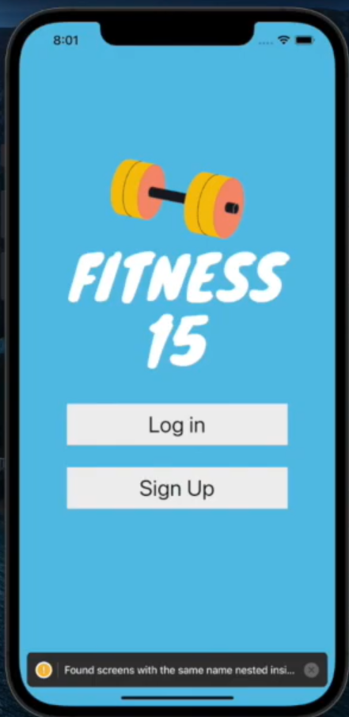
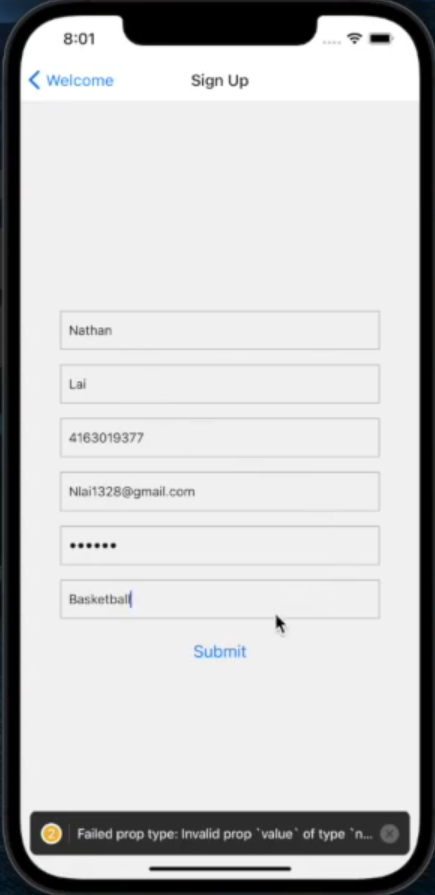
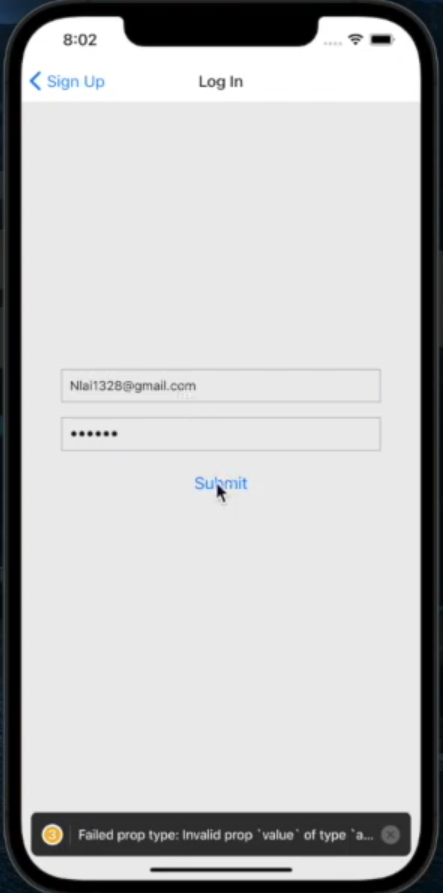
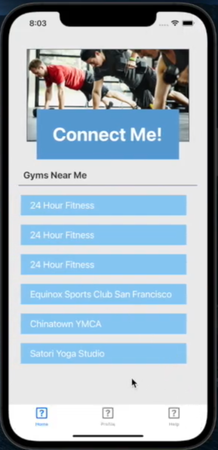
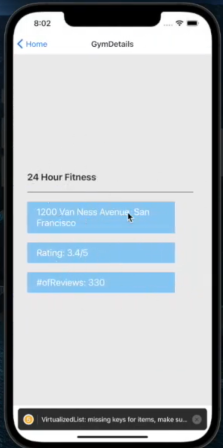
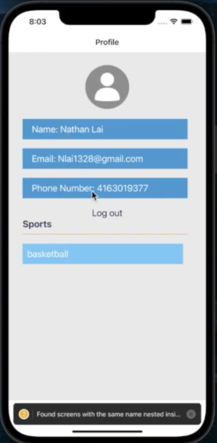
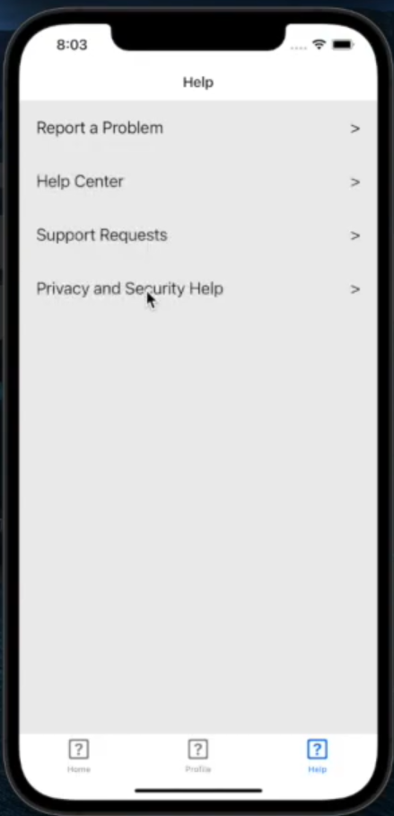

# Fitness-15

This is a mobile fitness app that connects users with similar interests in physical activity with each other using a matching algorithm. It also provides locations of the nearest gyms using the locations API. Check the project out on devpost: https://devpost.com/software/fitness-15

To demo the app, you have to have expo, node, and the required libraries installed. You also have to download the expo client on your phone or use a virtual machine. Then simply clone the repo using `git clone` then `expo start` in the cloned repo, scan the QR code and enjoy!

Here's a quick preview (if you don't want to go to devpost or download the repo, which takes too long anyway):

## Initial Screen

</img>

## Signup

</img>

## Login

</img>

## Homepage

</img>

## Match Screen

</img>

## Gym Location

</img>

## Profile

</img>

## Help Screen

</img>
